# Documento de Diseño UX/UI y Maquetas

**Proyecto:** Plataforma de Procesos Participativos Reglados
**Mandante:** Gobierno Regional de Valparaíso — Unidad de Ordenamiento Territorial
**Proveedor:** AWNA
**Entregable:** Etapa 2 — Diseño UX/UI
**Versión:** 1.0 · 12 de agosto de 2026

---

## 1. Objeto del documento

Este documento presenta el diseño de interfaz y experiencia de usuario de la
plataforma: los criterios que lo guiaron, el sistema de diseño que lo sostiene,
la arquitectura de información de ambos entornos y las maquetas de cada pantalla.

Las maquetas que se presentan **no son bocetos**: son capturas de la plataforma
construida y en operación. Se optó por documentar el diseño sobre el sistema
real en lugar de sobre prototipos estáticos, de modo que lo que la contraparte
valida es exactamente lo que recibe. Cada pantalla de este documento es
verificable ingresando a la plataforma.

Los datos visibles en las capturas corresponden a un ambiente de demostración con
información de prueba. Los nombres, RUT y correos son ficticios.

---

## 2. Criterios de diseño

El diseño responde a cinco criterios, en este orden de prioridad:

**1. Identidad institucional.** La interfaz aplica las normas gráficas del
Gobierno Regional de Valparaíso: escudo institucional, marca *Región de
Derechos*, identidad del Consejo Regional y la paleta derivada de los colores del
escudo. El ciudadano debe reconocer que está en un sitio oficial del GORE desde
el primer segundo, sin necesidad de leer el pie de página.

**2. El trámite por sobre la estética.** La contraparte fue explícita en el
kick-off: no se busca innovación visual. La referencia operativa es el portal de
consultas ciudadanas del Ministerio del Medio Ambiente. Cada decisión visual se
subordina a que el ciudadano complete su observación.

**3. Lenguaje claro.** Las siglas técnicas del ordenamiento territorial (IPT,
PROT, ZUBC) no significan nada para quien no es del rubro. La interfaz las
acompaña siempre de su denominación completa, y reserva la sigla para las
etiquetas compactas donde el espacio no permite el nombre extendido.

**4. Accesibilidad universal.** Criterios WCAG 2.1 nivel AA aplicados de forma
sistemática, conforme al Kit Digital del Estado.

**5. Confianza en el registro.** La participación en una consulta pública es un
acto formal. La interfaz refuerza en cada paso que la observación queda
registrada en un expediente, quién la firma y qué ocurre después.

---

## 3. Sistema de diseño

### 3.1 Paleta cromática

Derivada del escudo institucional y del sistema gráfico del GORE.

| Rol | Color | Uso |
|---|---|---|
| Azul institucional | `#1F2862` | Color primario. Barras, botones principales, titulares |
| Azul profundo | `#131A47` | Estados *hover* y superficies densas |
| Azul claro | `#3A4796` | Acentos y realces |
| Dorado del escudo | `#ADA267` | Detalles de identidad institucional |
| Verde del puente | `#8FBE9A` | Acento secundario |
| Tinta | `#0F172A` | Texto principal |
| Tinta suave | `#475569` | Texto secundario |
| Gris apagado | `#94A3B8` | Metadatos y texto deshabilitado |
| Fondo | `#F8FAFC` | Fondo general de página |
| Superficie | `#FFFFFF` | Tarjetas y superficies elevadas |
| Borde | `#E2E8F0` | Separadores sutiles |

Colores de estado: éxito `#10B981`, advertencia `#F59E0B`, error `#EF4444`,
información `#06B6D4`.

Todas las combinaciones de texto sobre fondo cumplen la razón de contraste
mínima de 4.5:1 exigida por WCAG 2.1 AA.

### 3.2 Tipografía

Familia única **Inter**, en pesos 400 a 800, servida desde un proveedor con
política de privacidad sin rastreo. Se eligió por su alta legibilidad en
tamaños pequeños y por su amplia cobertura de caracteres, incluidos los
diacríticos del español.

La jerarquía tipográfica distingue cuatro niveles: titular de página, título de
sección, cuerpo de texto y metadato. Los titulares usan pesos altos y
espaciado negativo entre letras; el cuerpo mantiene interlineado amplio para
favorecer la lectura de textos normativos extensos.

### 3.3 Forma y profundidad

| Elemento | Valor |
|---|---|
| Radio de esquina, controles pequeños | 6 px |
| Radio de esquina, campos y botones | 10 px |
| Radio de esquina, tarjetas | 16 px |
| Radio de esquina, superficies mayores | 24 px |
| Etiquetas y píldoras | Radio completo |

Las sombras usan un tinte azul institucional en lugar de negro puro, en cinco
niveles de elevación. Esto integra la profundidad a la paleta y evita el gris
sucio que produce el negro translúcido sobre fondos fríos.

### 3.4 Movimiento

Las transiciones usan tres duraciones —150 ms, 250 ms y 500 ms— con curvas de
aceleración que salen rápido y desaceleran al final. Los bloques de contenido
aparecen progresivamente al entrar en el área visible.

**Respeto por la preferencia de movimiento reducido.** El sistema detecta la
preferencia del sistema operativo del usuario y, cuando está activa, presenta
todo el contenido de inmediato sin animación. Es un requisito de accesibilidad
para personas con trastornos vestibulares.

### 3.5 Componentes base

La interfaz se construye sobre Bootstrap 5.3 con una capa de personalización
propia. Los componentes recurrentes son: tarjeta de proceso, etiqueta de estado,
etiqueta de tipo de instrumento, barra de progreso de plazo, campo de formulario
con etiqueta y mensaje de error asociado, tabla de datos con filtros, y bloque
de aviso informativo.

---

## 4. Arquitectura de información

### 4.1 Portal Ciudadano

```
Portada
├── Consultas públicas                    (listado con filtros)
│   └── Ficha del proceso
│       ├── Antecedentes técnicos         (descarga)
│       ├── Formulario de observación
│       │   └── Confirmación de envío
│       └── Respuestas institucionales
├── Cómo funciona
└── Preguntas frecuentes
```

La navegación es plana a propósito: desde cualquier punto del portal, el
ciudadano llega a la ficha de un proceso en un máximo de dos clics.

### 4.2 Flujo de participación

El portal presenta el proceso en cuatro pasos explícitos, visibles en la portada:

| Paso | Acción | Diseño |
|---|---|---|
| 1 | Selecciona la consulta | Tarjetas con estado y plazo restante |
| 2 | Revisa los antecedentes | Panel lateral de documentos descargables |
| 3 | Identifícate | ClaveÚnica o participación como invitado |
| 4 | Envía tu observación | Formulario con confirmación visual y por correo |

La decisión de diseño más relevante del flujo es que **la identificación y la
observación ocurren en la misma pantalla**. El ciudadano que no usa ClaveÚnica
no abandona la ficha del proceso: declara su identidad y redacta su observación
en un solo formulario continuo. Se eliminó el registro previo de cuenta porque
introducía un corte —revisar el correo, volver al sitio, retomar el proceso—
donde una fracción relevante de los participantes se perdía.

### 4.3 Backoffice

```
Panel de inicio
├── Consultas                             (listado, papelera)
│   ├── Detalle del proceso
│   │   └── Antecedentes técnicos         (carga, reemplazo, versiones)
│   ├── Formulario de creación
│   └── Formulario de edición
├── Observaciones                         (listado, archivadas)
│   ├── Detalle de observación
│   │   └── Respuesta institucional
│   ├── Respuesta por lote
│   └── Exportación CSV / Excel
├── Usuarios                              (solo super-administrador)
└── Bitácora de auditoría                 (solo super-administrador)
```

El backoffice usa una barra de navegación horizontal de cinco entradas, sin menús
anidados. El criterio fue que un funcionario capacitado una vez pueda operar la
plataforma meses después sin volver a consultar el manual.

---

## 5. Maquetas — Portal Ciudadano

### 5.1 Portada

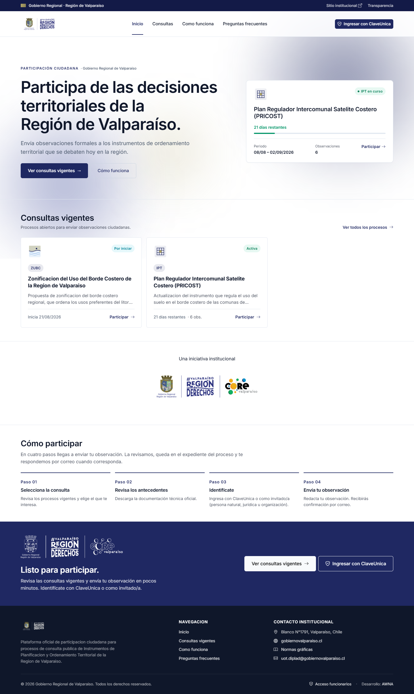

La portada resuelve tres preguntas en orden: qué es esto, qué procesos están
abiertos y cómo participo.

El encabezado combina una barra institucional superior —con enlaces al sitio del
GORE y a Transparencia— y la barra de navegación con el escudo y la marca
*Región de Derechos*. El botón de ingreso con ClaveÚnica ocupa la posición de
mayor jerarquía del encabezado.

El bloque principal presenta el propósito de la plataforma junto a una tarjeta
destacada del proceso más próximo a cerrar, con su plazo restante, período y
número de observaciones recibidas. La barra de progreso comunica visualmente
cuánto queda del plazo.

Bajo el bloque principal, las consultas vigentes se presentan como tarjetas con
tipo de instrumento, estado y plazo. Cierran la página el bloque de identidad
institucional, los cuatro pasos para participar y una llamada final a la acción.

### 5.2 Listado de consultas públicas

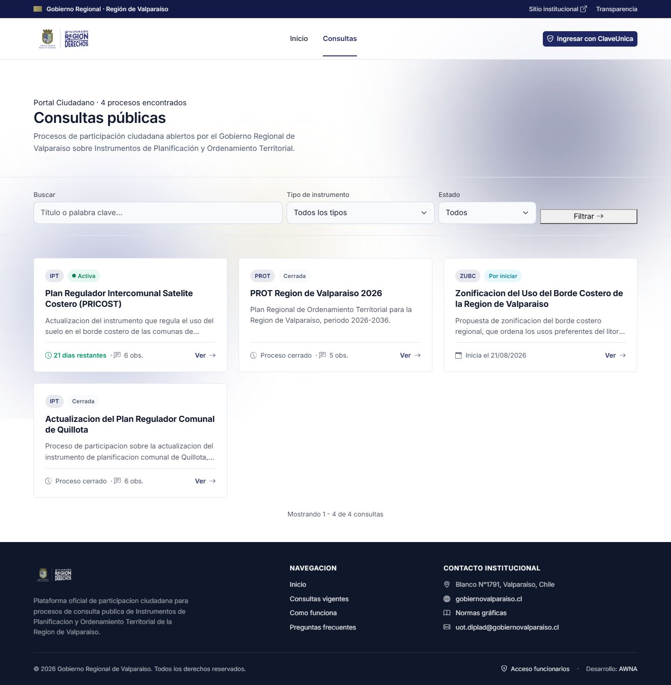

El listado incorpora los tres filtros que la contraparte identificó como
necesarios: búsqueda por texto libre, tipo de instrumento y estado del proceso.
El encabezado informa el número de procesos encontrados.

Cada tarjeta declara el tipo de instrumento y el estado mediante etiquetas
diferenciadas por color, y en su pie muestra el dato temporal pertinente según el
estado: días restantes si está activa, fecha de inicio si está por comenzar, o la
leyenda de proceso cerrado. El número de observaciones recibidas es visible en
todos los casos, como señal de que el proceso tiene participación real.

### 5.3 Ficha del proceso y formulario de participación

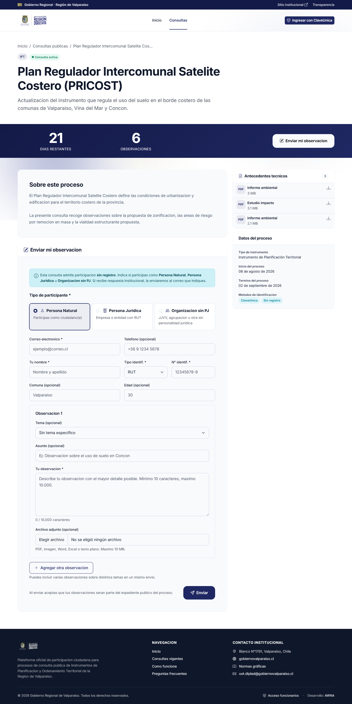

Es la pantalla central de la plataforma. Su estructura responde al orden en que
el ciudadano necesita la información.

La cabecera presenta el tipo de instrumento, el estado, el título y el resumen.
Inmediatamente debajo, una franja institucional destaca las dos cifras que
determinan si el ciudadano puede participar —días restantes y observaciones
recibidas— junto al botón de acceso directo al formulario.

El cuerpo se organiza en dos columnas. La columna principal contiene la
descripción del proceso y el formulario de participación. La columna lateral
agrupa los antecedentes técnicos descargables, con su formato y peso, y la ficha
de datos del proceso: tipo de instrumento en su denominación completa, fechas y
métodos de identificación admitidos.

El formulario aplica las decisiones de diseño de participación:

- **Aviso inicial** que explica en lenguaje directo que la consulta admite
  participación sin registro y qué ocurre con los datos entregados.
- **Selección del tipo de participante** —persona natural, persona jurídica u
  organización sin personalidad jurídica— como primera decisión, porque determina
  qué campos de identidad se solicitan. Cada opción lleva una descripción breve
  que evita la consulta al funcionario.
- **Campos de identidad** con distinción explícita entre obligatorios y
  opcionales. El tipo de documento permite RUT o pasaporte, de modo que la
  participación de residentes extranjeros no queda bloqueada.
- **Bloque de observación repetible.** El botón «Agregar otra observación»
  permite presentar varias observaciones sobre temas distintos en un mismo
  envío, sin repetir los datos de identidad.
- **Contador de caracteres** y declaración explícita de los formatos y el peso
  máximo del archivo adjunto, antes de que el ciudadano intente subirlo.
- **Declaración de consecuencia** junto al botón de envío: la observación pasa a
  formar parte del expediente público del proceso.

### 5.4 Comportamiento responsive

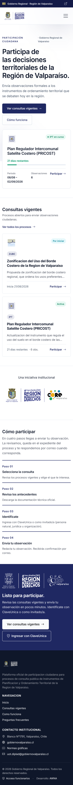

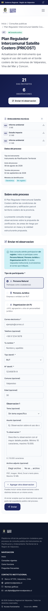

El portal está diseñado para operar desde teléfono, que es el dispositivo
predominante de acceso ciudadano. La navegación se colapsa en un menú
desplegable, las tarjetas pasan a una columna y las cifras del proceso se apilan.

La decisión específica del comportamiento móvil es el **orden de los bloques en
la ficha del proceso**: en pantallas angostas, los antecedentes técnicos se
presentan *antes* del formulario. En escritorio ocupan la columna lateral y son
visibles en paralelo, pero al apilarse quedarían después del formulario, y el
ciudadano habría redactado su observación sin haber visto la documentación que
debe fundamentarla. El ajuste se incorporó a partir de la revisión de la
contraparte.

---

## 6. Maquetas — Backoffice

### 6.1 Acceso

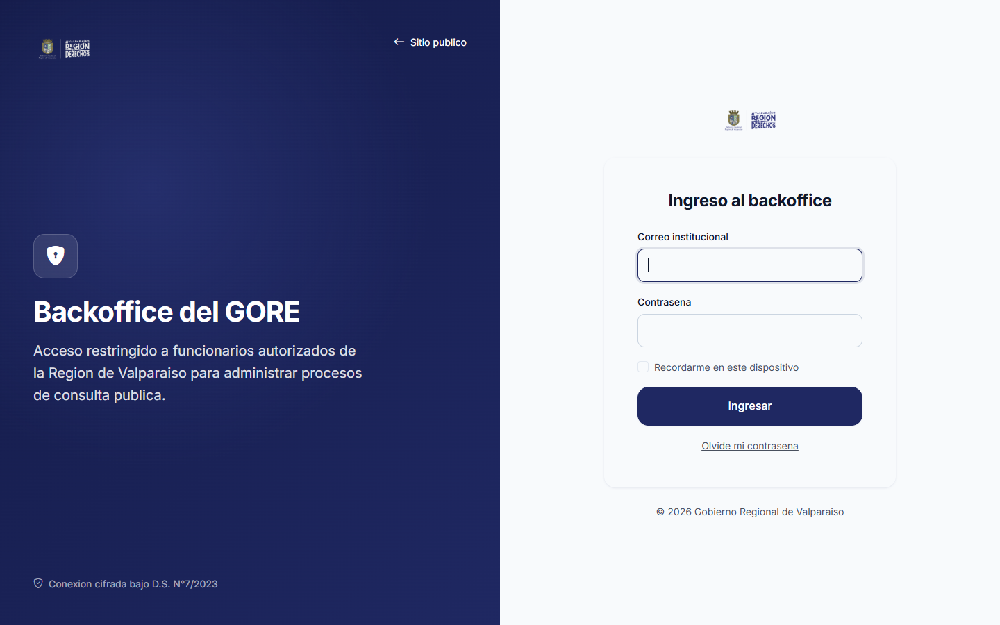

El acceso del personal está separado del portal ciudadano y no se enlaza desde la
navegación pública, salvo un enlace discreto en el pie de página. Es una decisión
deliberada: reduce la superficie de intentos de acceso y evita que el ciudadano
confunda ambos entornos.

### 6.2 Panel de inicio

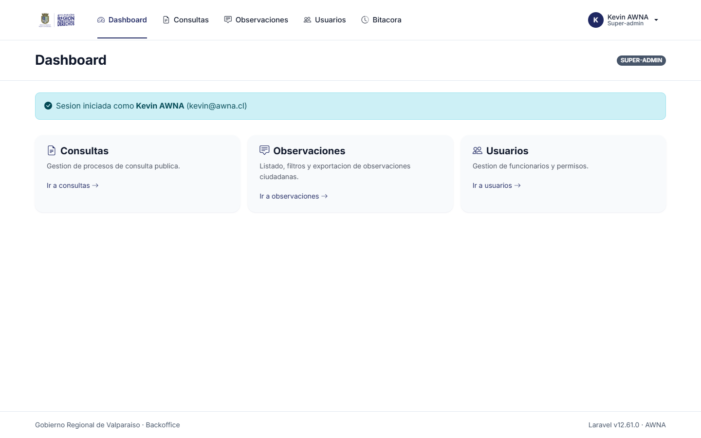

El panel confirma la sesión iniciada y el rol vigente —visible como etiqueta
junto al título— y presenta los accesos a los módulos de gestión. La etiqueta de
rol es relevante en operación: las capacidades disponibles difieren entre
funcionario y super-administrador, y el funcionario debe saber con qué perfil
está actuando.

### 6.3 Gestión de procesos

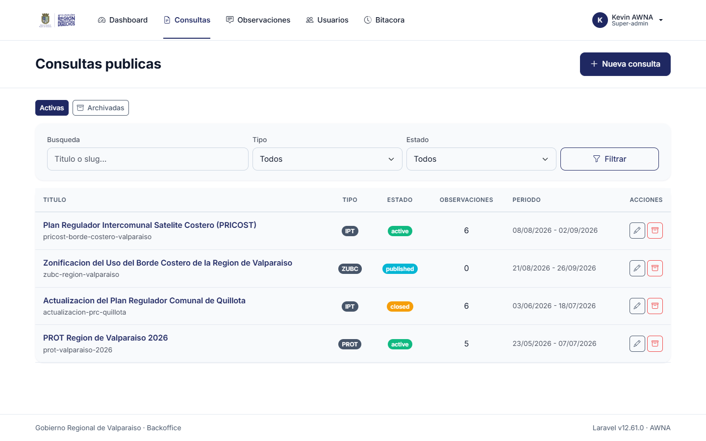

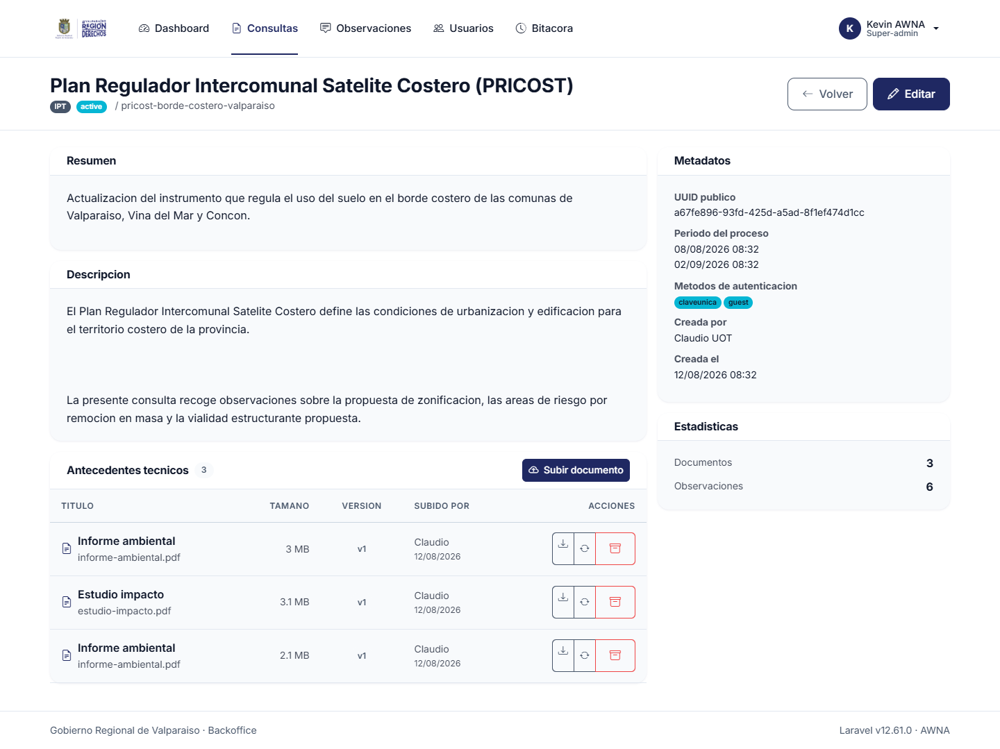

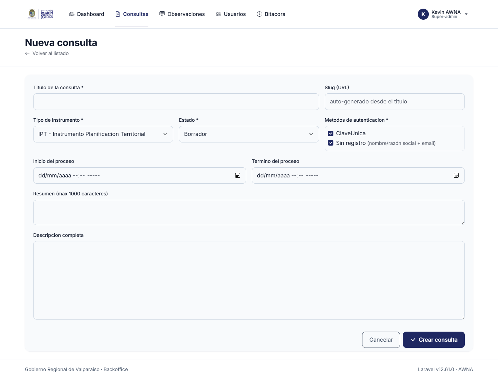

El listado presenta los procesos con su estado y permite acceder a la papelera de
procesos archivados, desde donde pueden restaurarse. El detalle reúne la
información del proceso y la gestión de sus antecedentes técnicos: carga,
reemplazo con versionado e historial de versiones.

El formulario de creación agrupa los campos en bloques —identificación del
proceso, período de participación y métodos de identificación admitidos— y usa
etiquetas en lenguaje del dominio territorial, no del modelo de datos.

### 6.4 Observaciones recibidas

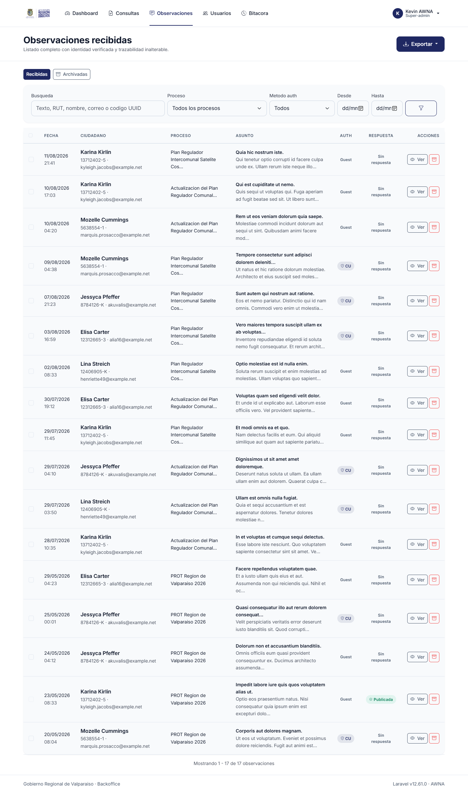

Es la pantalla de mayor densidad de información del sistema, y la que más usan
los funcionarios durante un proceso activo. Su diseño resuelve cuatro
necesidades simultáneas.

**Búsqueda y filtrado.** La búsqueda cubre texto, RUT, nombre, correo y el código
identificador de la observación. Los filtros permiten acotar por proceso, método
de identificación y rango de fechas.

**Lectura en barrido.** Cada fila expone fecha y hora, identidad del participante
con su RUT y correo, proceso, asunto con un extracto del cuerpo, método de
identificación y estado de respuesta. El funcionario puede evaluar una
observación sin abrirla.

**Trabajo por lote.** La casilla de selección por fila habilita la emisión de una
respuesta institucional común a varias observaciones, que es el patrón real de
trabajo cuando decenas de participantes plantean la misma materia.

**Separación de lo archivado.** Las pestañas *Recibidas* y *Archivadas*
mantienen fuera del flujo de trabajo las observaciones retiradas del listado sin
destruirlas, preservando el expediente.

La exportación de la base completa en CSV y Excel está disponible desde el
encabezado.

### 6.5 Detalle de observación

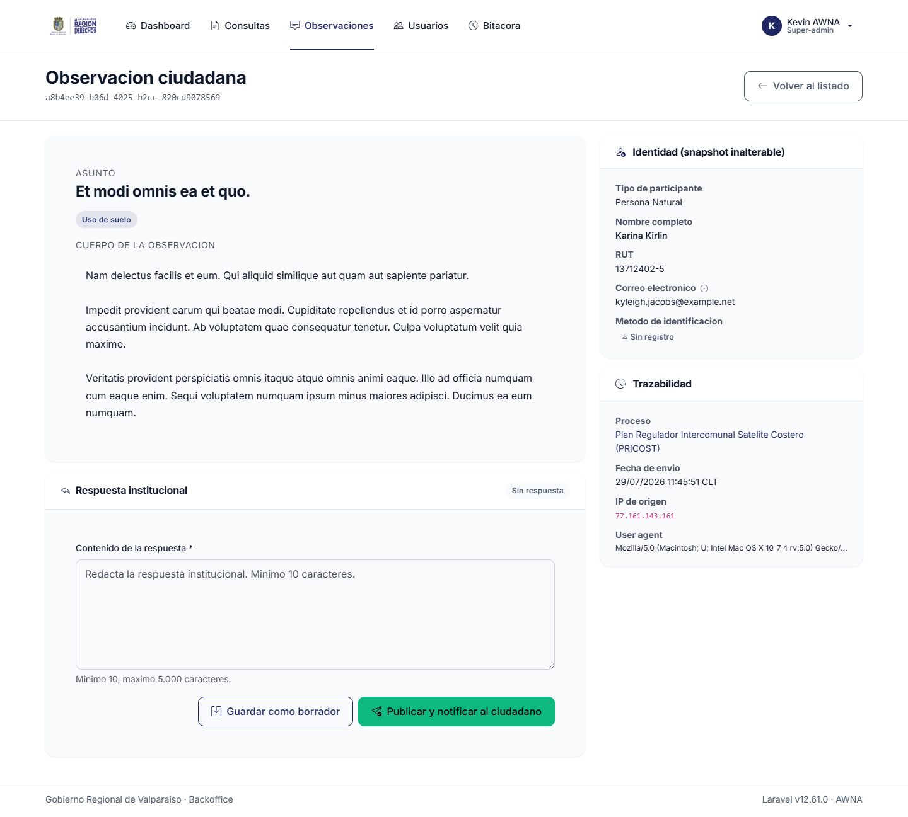

El detalle presenta la observación íntegra junto al registro de identidad
capturado al momento del envío, incluyendo tipo de participante, documento de
identidad, datos de contacto y método de identificación empleado. Desde esta
pantalla el funcionario descarga el archivo adjunto y emite la respuesta
institucional.

### 6.6 Usuarios y bitácora

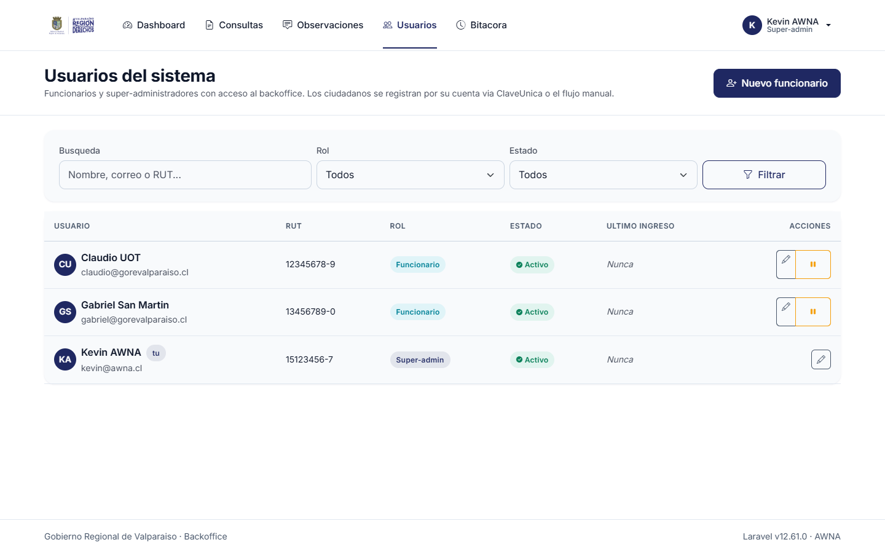

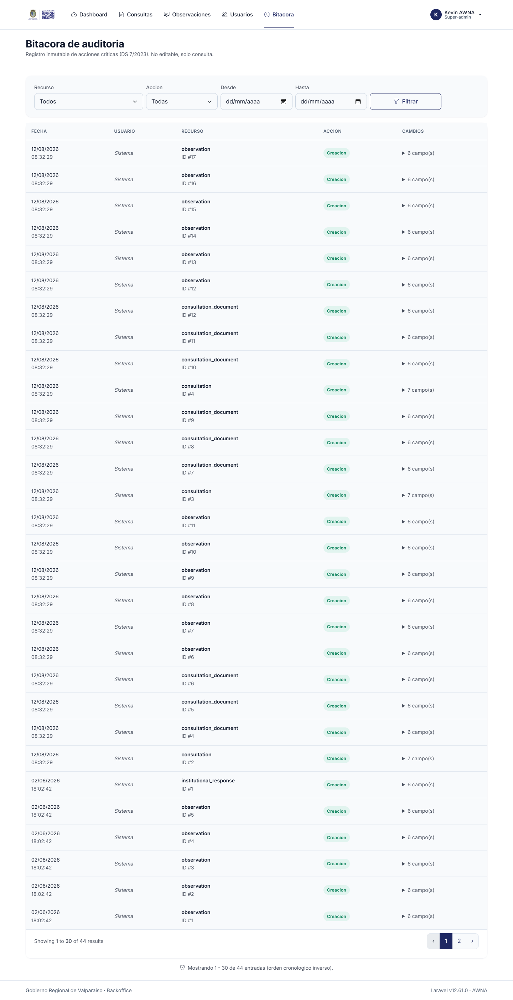

Ambos módulos son exclusivos del super-administrador. La gestión de usuarios
permite crear funcionarios, asignar rol y desactivar cuentas —nunca eliminarlas,
para preservar la trazabilidad de las acciones registradas a su nombre.

La bitácora registra las acciones sobre las entidades del sistema con su autor y
fecha, excluyendo de su registro los campos sensibles.

---

## 7. Accesibilidad

Criterios WCAG 2.1 nivel AA aplicados en la construcción:

| Criterio | Aplicación |
|---|---|
| Contraste de color | Todas las combinaciones de texto sobre fondo alcanzan al menos 4.5:1 |
| Estructura semántica | Encabezados jerárquicos correlativos, listas, tablas con encabezado y regiones de página |
| Navegación por teclado | Todos los controles son alcanzables y operables por teclado, con foco visible |
| Formularios | Cada campo tiene etiqueta asociada; los mensajes de error se vinculan al campo y describen la corrección |
| Imágenes | Texto alternativo en imágenes con contenido; las decorativas se ocultan de los lectores de pantalla |
| Independencia del color | El estado de un proceso se comunica por color y por texto, nunca solo por color |
| Movimiento | Se respeta la preferencia de movimiento reducido del sistema operativo |
| Redimensionado | El contenido es utilizable con la tipografía ampliada al 200% |

**Alcance de la verificación.** Los criterios se aplicaron durante el diseño y la
construcción. No se ejecutó una auditoría formal de conformidad por un tercero
certificador. Si el GORE la requiere como parte de la recepción, es una actividad
acotada que puede realizarse sobre la plataforma ya desplegada.

---

## 8. Nota sobre el acceso con ClaveÚnica en las maquetas

Las capturas muestran el botón de ingreso con ClaveÚnica y la mención a ese
método en el formulario de participación, porque forman parte del diseño
contratado y están implementados en la plataforma.

A la fecha de este documento, **la entrada por ClaveÚnica está oculta en el
ambiente productivo**, a la espera de que la Unidad de Gobierno Digital emita las
credenciales de integración. Mientras tanto, la plataforma opera con la
participación sin registro, que preserva la exigencia de identidad obligatoria.
Cuando las credenciales estén disponibles, la entrada se activa mediante
configuración, sin desarrollo adicional ni cambios en el diseño aquí presentado.

El detalle de esta dependencia está en el *Documento de Requerimientos*, sección
11, y en `docs/claveunica/solicitud-credenciales.md`.

---

## 9. Validación

El diseño fue sometido a revisión de la contraparte del GORE durante la ejecución
del proyecto. Los ajustes solicitados en el Acta de Observaciones de junio de
2026 y en las revisiones de julio de 2026 se encuentran incorporados en las
maquetas de este documento. Entre ellos:

| Ajuste solicitado | Incorporación |
|---|---|
| Portada más expresiva del propósito de la plataforma | Bloque principal con proceso destacado, plazo y llamada a la acción |
| Eliminar el registro previo de cuenta ciudadana | Participación e identidad resueltas en el mismo formulario |
| Distinguir persona jurídica y organización sin personalidad jurídica | Selección de tipo de participante con campos propios |
| Retirar el acceso prominente al backoffice de la navegación pública | Acceso reubicado en el pie de página |
| Denominación completa de los instrumentos, no solo la sigla | Nombre extendido en ficha y datos del proceso |
| Antecedentes antes del formulario en teléfono | Reordenamiento de bloques en pantallas angostas |
| Fechas en español y leyenda del último día del plazo | Formato localizado y leyenda diferenciada |
