# Manual de Usuario

**Plataforma de Procesos Participativos Reglados — GORE Valparaíso**

| | |
|---|---|
| Versión | 1.0 |
| Fecha | 29 de septiembre de 2026 |
| Autor | AWNA |
| Destinatario | Ciudadanía y funcionarios del Gobierno Regional de Valparaíso |
| Dirección del portal | `https://www.participa.gobiernovalparaiso.cl` |
| Documentos relacionados | Manual del Administrador (referencia detallada del backoffice), Manual de Despliegue y Operación |

---

## Cómo usar este manual

El manual tiene dos partes, una por cada tipo de usuario:

- **Parte A — Ciudadanía:** cómo revisar un proceso de consulta pública, descargar sus antecedentes y enviar observaciones.
- **Parte B — Funcionarios del GORE:** cómo ingresar al backoffice, publicar un proceso, revisar las observaciones, responderlas y exportar el expediente.

Cada tarea está escrita como una secuencia de pasos. Las reglas finas del sistema (validaciones, límites, columnas del compendio, bitácora) están en el **Manual del Administrador**, que complementa a este documento.

---

## Parte A — Ciudadanía

### A1. Qué puede hacer una persona en el portal

En el portal cualquier persona puede, sin crear una cuenta:

1. Ver los procesos de consulta pública que el Gobierno Regional tiene abiertos, próximos o cerrados.
2. Leer la descripción de cada proceso y descargar sus antecedentes técnicos.
3. Enviar una o varias observaciones formales mientras el proceso esté abierto.
4. Leer las respuestas institucionales que el GORE publique.

### A2. Encontrar un proceso

1. Ingresar a `https://www.participa.gobiernovalparaiso.cl`.
2. La portada muestra las cifras de participación y los procesos más recientes. Para ver todos, hacer clic en **Consultas** en el menú superior.
3. Cada tarjeta indica el tipo de instrumento (por ejemplo, *Instrumento de Planificación Territorial*), su estado y los días que quedan para participar.
4. Hacer clic en la tarjeta para abrir la ficha del proceso.

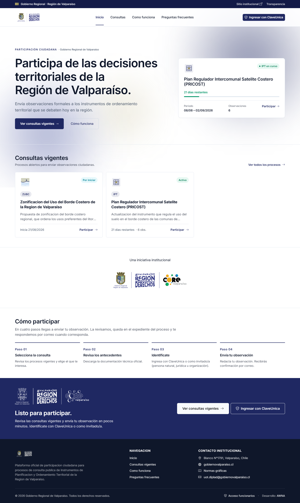

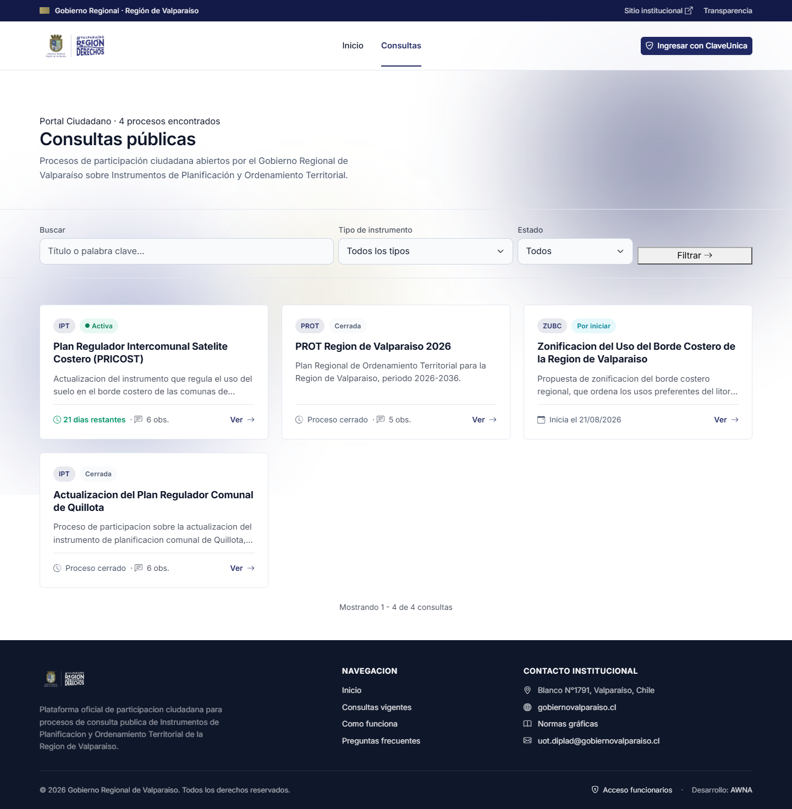

### A3. Revisar la ficha y descargar los antecedentes

La ficha de un proceso reúne toda la información necesaria para participar:

- **Encabezado:** nombre del proceso, tipo de instrumento y estado.
- **Franja de cifras:** días restantes y cantidad de observaciones recibidas.
- **Sobre este proceso:** descripción completa.
- **Antecedentes técnicos:** los documentos del proceso (memorias, planos, informes). Se descargan con el ícono de flecha junto a cada archivo.
- **Datos del proceso:** fechas de inicio y término, y los métodos de identificación que admite.

Se recomienda leer los antecedentes antes de observar. En el teléfono móvil, los archivos aparecen antes del formulario por ese motivo.

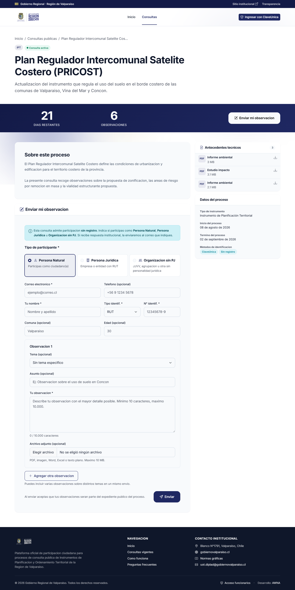

### A4. Enviar una observación

El formulario **Enviar mi observación** aparece en la ficha solo mientras el proceso está abierto. Según cómo lo haya configurado el GORE, se puede participar de dos formas.

#### Opción 1: con ClaveÚnica

1. Hacer clic en **Ingresar con ClaveÚnica** (arriba a la derecha o en la ficha del proceso).
2. Ingresar RUN y clave en el sitio oficial de ClaveÚnica.
3. Al volver al portal, el formulario indica con qué nombre y correo quedará registrada la observación. No hay que escribir los datos personales.
4. Continuar en el paso **«Escribir la observación»**, más abajo.

ClaveÚnica solo identifica a personas naturales. Las empresas y organizaciones participan por la opción 2.

#### Opción 2: sin registro

1. En **Tipo de participante**, elegir una de las tres tarjetas:
   - **Persona Natural:** se participa como ciudadano o ciudadana.
   - **Persona Jurídica:** empresa o entidad con RUT.
   - **Organización sin PJ:** junta de vecinos, agrupación u otra organización sin personalidad jurídica.
2. Completar los datos. Los marcados con asterisco (*) son obligatorios:

| Tipo de participante | Obligatorio | Opcional |
|---|---|---|
| Persona Natural | Correo, nombre, tipo de identificación (RUT o pasaporte) y número | Teléfono, comuna, edad |
| Persona Jurídica / Organización sin PJ | Correo, razón social, RUT de la entidad | Teléfono, nombre de fantasía, dirección |

El correo es importante: **a esa dirección se enviará la respuesta institucional**.

#### Escribir la observación

1. **Tema** (opcional): elegir entre Uso de suelo, Vialidad, Áreas verdes, Patrimonio, Equipamiento, Riesgo natural u Otro.
2. **Asunto** (opcional): una frase que resuma la observación.
3. **Tu observación** (obligatorio): el texto, entre 10 y 10.000 caracteres.
4. **Archivo adjunto** (opcional): un archivo de hasta 10 MB (PDF, imagen, Word, Excel, OpenDocument o texto plano).
5. Para observar otro tema en el mismo envío, hacer clic en **Agregar otra observación**. Se pueden incluir hasta 20, cada una con su tema, texto y adjunto.
6. Revisar y hacer clic en **Enviar**.

Al enviar, las observaciones pasan a formar parte del expediente público del proceso. **Una vez enviadas no se pueden modificar.** Si se quiere corregir algo, se envía una observación nueva mientras el proceso siga abierto.

### A5. Comprobante de envío

Después de enviar, el portal muestra una pantalla de confirmación con el **código del envío**. Ese código es el comprobante de participación: conviene guardarlo o sacar una captura de pantalla.

Quien participó sin registro recibe además un enlace para volver a ver su comprobante. El enlace lleva un código secreto y no debe compartirse.

### A6. Recibir y leer la respuesta institucional

Cuando el GORE responde una observación:

- La respuesta se envía al correo declarado (o al de ClaveÚnica).
- Las respuestas publicadas se pueden leer en la ficha del proceso.

### A7. Mensajes que puede mostrar la ficha

| Mensaje | Qué significa |
|---|---|
| **Participación no habilitada aún** | El proceso fue anunciado pero todavía no comienza el plazo para observar |
| **Proceso cerrado** | Terminó el plazo. Los antecedentes siguen disponibles para consulta |
| **Participa en este proceso** (con botón de ClaveÚnica) | El proceso solo admite participación identificada con ClaveÚnica |
| **Participación no disponible por ahora** | El proceso requiere ClaveÚnica y ese servicio no está habilitado en este momento |
| **Cuenta institucional** | Se ingresó con una cuenta de funcionario; para participar como ciudadano hay que cerrar esa sesión |

Por seguridad, el portal acepta hasta 5 envíos por minuto desde una misma conexión. Si aparece un aviso de exceso, basta con esperar un minuto.

---

## Parte B — Funcionarios del GORE

### B1. Ingresar al backoffice

1. Ingresar a `https://www.participa.gobiernovalparaiso.cl/admin/login` (también está el enlace **Acceso funcionarios** al pie del portal).
2. Escribir el correo institucional y la contraseña, y hacer clic en **Ingresar**.
3. En el primer ingreso, cambiar la contraseña desde el menú de usuario (arriba a la derecha) → **Perfil**.

Cada funcionario debe tener su propia cuenta. La bitácora atribuye cada acción a quien la hizo, así que compartir credenciales rompe la trazabilidad del expediente.

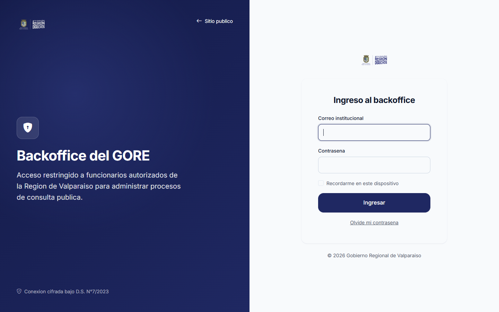

Si se olvida la contraseña, un super-admin puede asignar una nueva desde **Usuarios → Editar**.

### B2. El panel principal

Al entrar se llega al **Dashboard**, con las cifras generales y la actividad reciente. El menú superior da acceso a:

| Menú | Para qué sirve | Quién lo ve |
|---|---|---|
| Dashboard | Resumen general | Todos los funcionarios |
| Consultas | Crear y administrar los procesos | Todos los funcionarios |
| Observaciones | Revisar, responder y exportar lo recibido | Todos los funcionarios |
| Usuarios | Crear y desactivar cuentas de funcionarios | Solo super-admin |
| Bitácora | Registro de auditoría de todas las acciones | Solo super-admin |

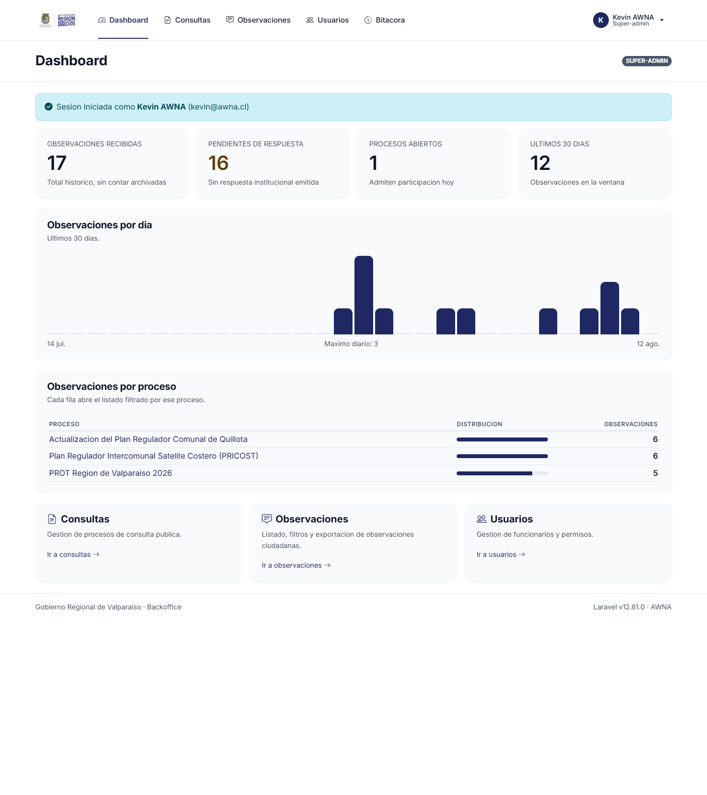

### B3. Crear y publicar un proceso de consulta

1. Ir a **Consultas → Nueva consulta**.
2. Completar el formulario:
   - **Título:** el nombre que verá la ciudadanía.
   - **Resumen:** una bajada breve para la tarjeta del listado.
   - **Descripción:** el texto completo de la ficha.
   - **Tipo de instrumento:** IPT, PROT, ZUBC u Otro.
   - **Fechas de inicio y término:** la ventana en que se reciben observaciones.
   - **Métodos de participación:** ClaveÚnica, Sin registro, o ambos.
   - **Estado:** dejar en **Borrador** mientras se prepara.
3. Guardar.
4. Desde la ficha de la consulta, subir los **antecedentes técnicos** (ver B4).
5. Cuando todo esté listo, editar la consulta y cambiar el estado a **Activa** (o a **Publicada** si solo se quiere anunciar, sin recibir observaciones todavía).

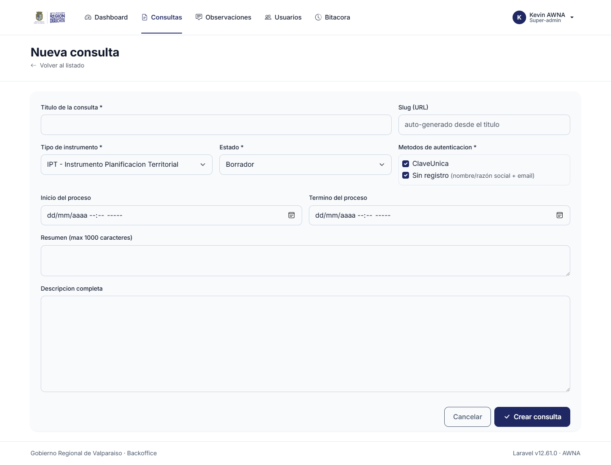

**Las fechas mandan.** Una consulta *Activa* solo recibe observaciones dentro de su ventana: antes de la fecha de inicio se muestra como próxima y después de la de término, como cerrada. No hace falta entrar a cerrarla el último día.

| Estado | Visible en el portal | Recibe observaciones |
|---|:---:|:---:|
| Borrador | No | No |
| Publicada | Sí | No (se anuncia como próxima) |
| Activa | Sí | Sí, dentro de las fechas |
| Cerrada | Sí | No |
| Archivada | No | No |

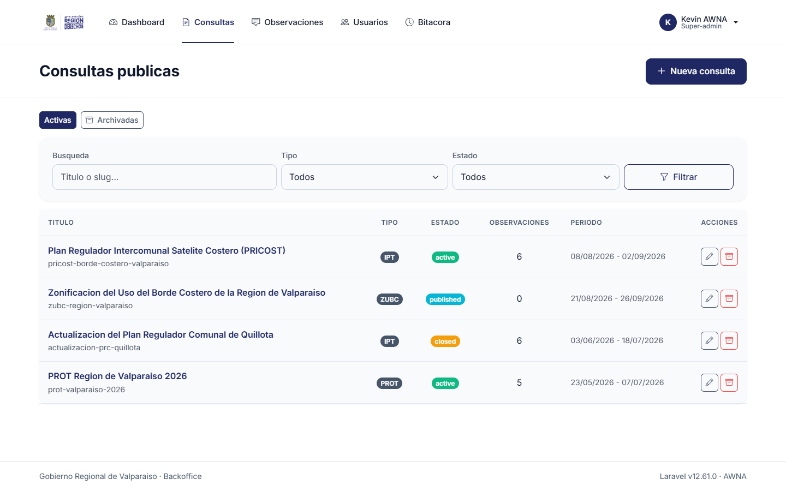

### B4. Subir y reemplazar antecedentes

1. Abrir la consulta desde **Consultas** y hacer clic en su título.
2. En la sección **Antecedentes**, indicar un título, una descripción opcional y elegir el archivo (hasta 110 MB).
3. Hacer clic en **Subir**.

Para actualizar un documento se usa **Reemplazar** → **Subir nueva versión**: el sistema guarda la versión anterior y publica la nueva con un número de versión mayor, así el historial queda completo. Cada archivo queda con una huella digital (hash SHA-256) que permite comprobar después que no fue alterado.

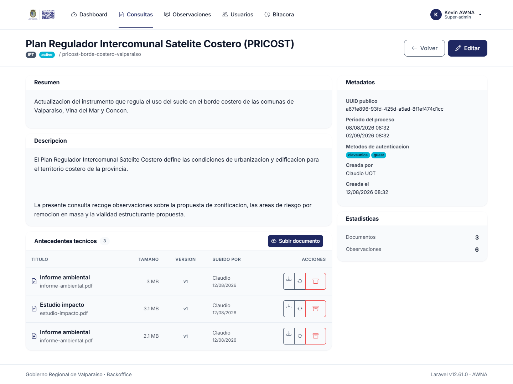

### B5. Revisar las observaciones recibidas

1. Ir a **Observaciones**. El listado muestra lo recibido, de lo más reciente a lo más antiguo.
2. Usar los filtros para acotar: **Búsqueda** (texto, RUT, nombre, correo o código), **Proceso**, **Método de identificación** y rango de fechas **Desde / Hasta**. Luego hacer clic en el botón de filtro.
3. Hacer clic en **Ver** para abrir la ficha completa de una observación: datos del participante, texto, adjunto y estado de la respuesta.

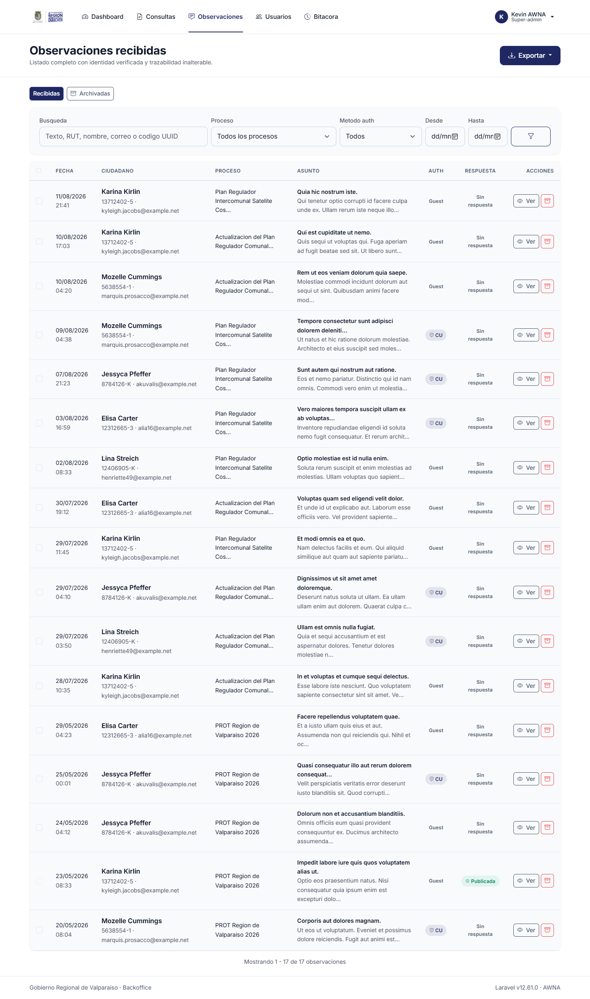

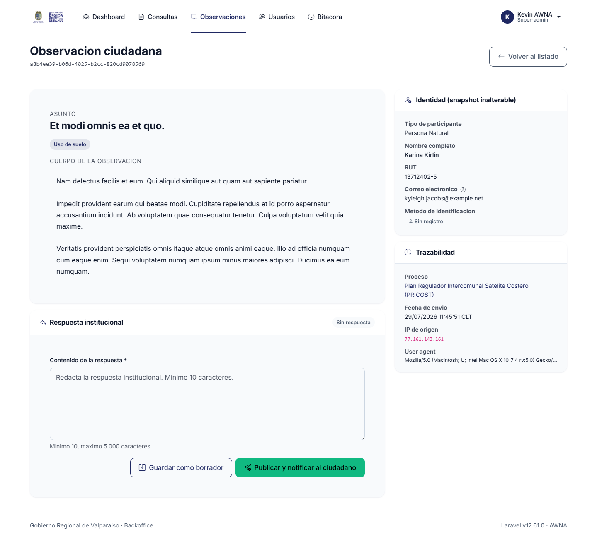

**Las observaciones no se pueden editar**, ni siquiera por un super-admin. Es una garantía del proceso reglado. Lo único posible es **archivar** (solo super-admin) los envíos que claramente no corresponden, como spam o pruebas. El archivado es reversible desde el botón **Archivadas** y queda registrado en la bitácora. Ante la duda, no archivar.

### B6. Responder una observación

1. En la ficha de la observación, escribir la respuesta institucional (entre 10 y 5.000 caracteres).
2. Hacer clic en **Guardar borrador**. El borrador no lo ve el ciudadano y se puede corregir las veces que haga falta.
3. Cuando el texto esté revisado, hacer clic en **Publicar y notificar al ciudadano** y confirmar. La respuesta se hace visible y se envía por correo al participante.

**Una respuesta publicada no se puede editar ni borrar.** Revisar siempre el borrador antes de publicar.

#### Responder varias a la vez

Cuando muchas observaciones plantean lo mismo:

1. En el listado de **Observaciones**, marcar las casillas de las observaciones a responder.
2. Hacer clic en **Responder en lote**.
3. Redactar el texto una vez y confirmar. El sistema avisa si alguna de las seleccionadas ya tenía respuesta.

### B7. Exportar el expediente

En **Observaciones → Exportar** hay tres opciones:

| Opción | Qué se descarga |
|---|---|
| **XLSX** | El compendio de observaciones en planilla Excel |
| **CSV** | El mismo compendio en texto separado por comas |
| **Adjuntos en ZIP** | Todos los archivos adjuntos, más un índice y el compendio en Excel |

La exportación **respeta los filtros aplicados en pantalla**. Para exportar un solo proceso, filtrar primero por ese proceso.

El ZIP tarda cerca de un minuto en prepararse. Mientras el botón dice *Preparando…* hay que esperar sin volver a hacer clic ni recargar la página. Cada archivo adjunto va nombrado con el código del expediente, y así se cruza con su fila en el compendio. Si el filtro abarca más de 500 archivos o 500 MB, el sistema lo avisa y basta con acotar por fechas y descargar en dos partes.

Estos archivos contienen datos personales. No deben publicarse íntegros ni enviarse por canales no institucionales.

### B8. Administrar cuentas de funcionarios (super-admin)

1. Ir a **Usuarios → Nuevo funcionario**.
2. Ingresar RUT, nombre, apellido, correo, contraseña inicial y rol (**Funcionario** o **Super-admin**).
3. Guardar y entregar las credenciales a la persona por un canal seguro.

Cuando alguien deja de participar, **desactivar** su cuenta con el interruptor Activo/Inactivo, sin eliminarla. Así se conserva el registro de lo que hizo.

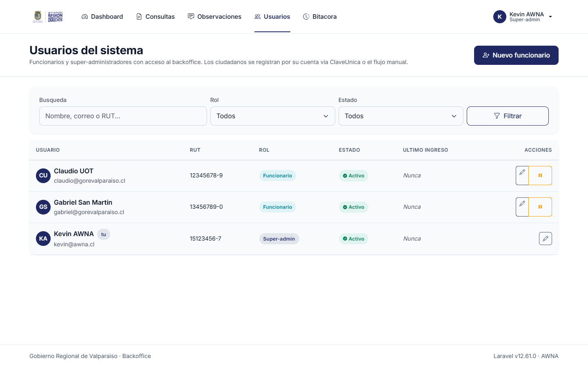

### B9. Revisar la bitácora (super-admin)

**Bitácora** registra automáticamente quién hizo qué y cuándo: creación y cambios de consultas, antecedentes, observaciones y cuentas. Es de solo lectura y se puede filtrar por ámbito, tipo de evento, usuario y fechas. Nunca registra contraseñas.

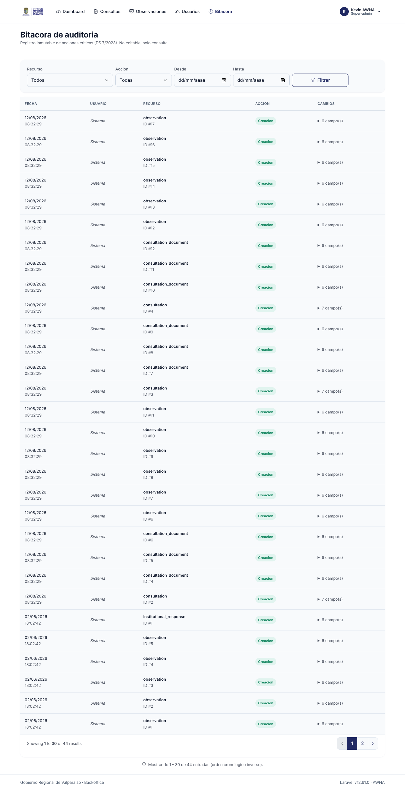

---

## Preguntas frecuentes

**Un ciudadano escribió mal su observación, ¿se puede corregir?**
No. Puede enviar una nueva mientras el proceso siga abierto. Si es un envío de prueba o spam, un super-admin puede archivarlo.

**¿Se puede eliminar una consulta?**
No. Se **archiva**, lo que la retira de la vista y conserva todo el expediente. Se restaura desde el filtro de archivadas.

**Publiqué una respuesta con un error, ¿qué hago?**
La respuesta publicada no cambia. Corresponde emitir una comunicación complementaria por la vía institucional que el GORE defina.

**Cerré una consulta antes de tiempo, ¿se perdieron observaciones?**
No. Cambiar el estado no borra nada. Basta con volver a dejarla *Activa* y ajustar las fechas.

**¿Se pierden los datos si falla el servidor?**
No. La base de datos tiene respaldos automáticos diarios con 7 días de retención y los archivos se guardan en almacenamiento redundante de AWS.

**¿A quién recurro si algo no funciona?**
Al equipo de la Unidad de Informática del GORE. Durante el período de garantía técnica, AWNA atiende las incidencias que informática le escale.
